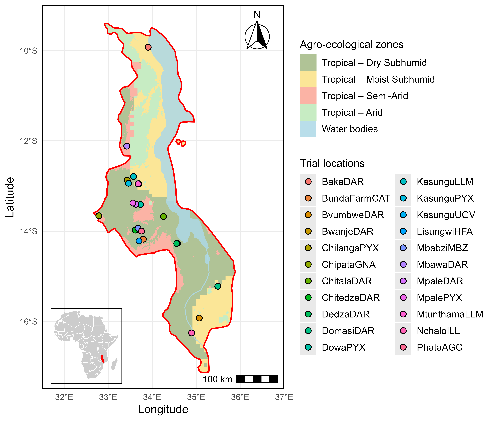

# High-resolution Spatial Allocation of Soybean Genotypes Using Enviromics

Spatially explicit cultivar recommendation in Malawi by integrating **Factor Analytic (FA) mixed models** and **Factor Analytic Selection Tools (FAST)** with **high-resolution environmental features (enviromics)** and **PLS / Random Forest–based spatial prediction**.

---

## Authors

**Mauricio S. Araújo¹**, **Gabriel M. Blasques²**, **Godfree Chigeza3**, **Erica P. Leles4**, **Michelle F. Santos4**, **Peter Goldsmith4**, **Brian W. Diers4**, **José B. Pinheiro¹**

### Affiliations

1. Genetics Diversity and Breeding Laboratory, Department of Genetics, University of São Paulo (USP), Piracicaba, SP, Brazil  
2. Agroenergy Laboratory, Department of Agronomy, Federal University of Viçosa (UFV), Viçosa, MG, Brazil  
3. USAID Feed the Future Soybean Innovation Lab, University of Illinois Urbana–Champaign (UIUC), IL, USA  
4. International Institute of Tropical Agriculture (IITA), Africa  

---

## Abstract

The integration of environmental data into predictive models has become a central component of modern plant breeding strategies. Coupling these data with robust statistical frameworks enables the selection and recommendation of genotypes with broad and specific adaptation across target populations of environments.

Here, we identify soybean genotypes with high performance and stability under contrasting conditions and predict genotypic performance in untested environments across Malawi. Grain yield data from **153 genotypes** evaluated between **2017 and 2024/25** across **53 environments** were analyzed. Genotype selection was performed using **Factor Analytic Selection Tools (FAST)**, while prediction in untested environments was achieved by integrating **factor analytic mixed models** with high-resolution environmental features through **partial least squares (PLS) regression**. Spatial interpolation based on **Random Forest** was applied to improve environmental characterization and optimize spatial prediction.

### Key findings

- **Broad adaptation:** `SCSENTINEL` consistently showed high performance and stability across environments.  
- **Which-won-where winners:** `SCSENTINEL`, `SC EXPT1`, `TGx20029FM`, `TGx20145GM`, `TGx201424FM`, `TGx203392GZ`, `TGx201421FM`, `TGx200124FM`, and `DARS CHITEDZE4`.  
- **Predicted grain yield range:** **482–4713 kg ha⁻¹**, revealing clear patterns of general and specific adaptation.  
- **Regional contrast:** Pairwise comparisons highlighted contrasting adaptation between **northern** and **southern Malawi**.

---

## Results (maps)

### Mega-environments / Which-won-where (winners by zone)

Spatial zones and genotype winners inferred from FA-based enviromics prediction.

---

## Repository layout

- `data/` – raw and processed multi-environment trial datasets  
- `mis/raster/` – environmental raster layers and covariates  
- `scripts/` – fully reproducible analysis pipeline (preprocessing → FA/FAST → prediction → mapping)  
- `outputs/` – final figures, maps, and derived results  

---

## Citation

If you use this code, data, or results in your research, please cite:

> Araújo, M. S., Blasques, G. M., Leles, E. P., Santos, M. F., Goldsmith, P., Chigeza, G., Diers, B. W., & Pinheiro, J. B. **High-resolution spatial allocation of soybean genotypes based on enviromics**. in review, 2026.

## Contact

Have questions, want to collaborate, or found a bug?  
Feel free to contact:

mauricioaraujj@usp.br  
jbaldin@usp.br
